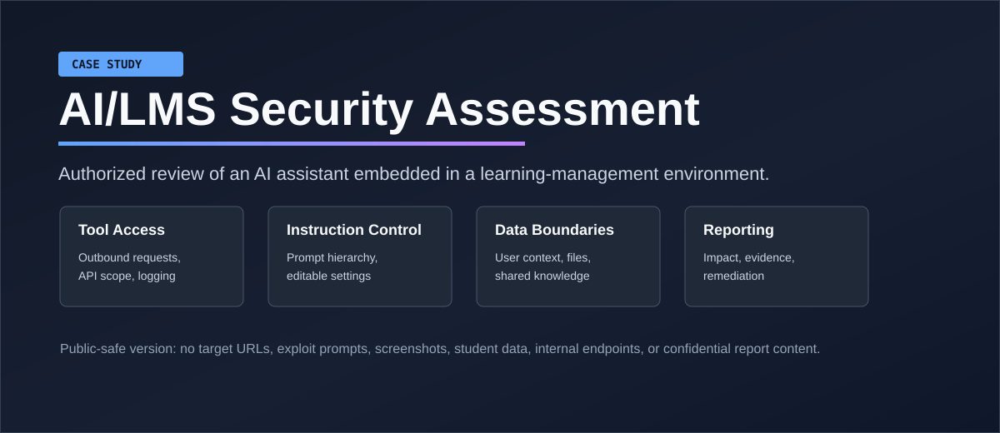

# AI/LMS Security Assessment Case Study

Public-safe case study from an authorized assessment of an AI assistant embedded
in a learning-management environment.

The private deliverable was a 24-page confidential report produced in May 2026.
It documented 16 validated findings from a standard-user session and translated
the evidence into remediation guidance. The confidential report stays private.
This repository keeps only the reusable parts: scope, control questions, finding
categories, remediation patterns, narrative lessons, and redaction discipline.

## What This Shows

- How I scoped an AI/LMS assessment
- Which control areas I tested
- How findings were translated into remediation
- How portfolio evidence can be shared without exposing private systems
- How to show meaningful assessment work while respecting disclosure boundaries

## The Short Version

The interesting part was not one dramatic bug. It was the combination: an AI
assistant with tools, memory, document retrieval, LMS context, user-editable
behavior, and permissive defaults.

Individually, each issue was fixable. Together, they created a path where a
normal user could influence assistant behavior, expose internal details, and
potentially move AI-visible data outside the trusted environment.

That is the real lesson: AI security is not just prompt filtering. It is tool
permissions, default settings, data boundaries, auditability, memory isolation,
document ingestion, and the boring-but-vital question:

> What can this assistant touch when a normal user gets clever?

## Assessment Areas

| Area | Review Question |
|---|---|
| Tool access | Can the assistant call external services, platform APIs, or messaging tools beyond the user's expectation? |
| Instruction hierarchy | Can user-editable instructions weaken system or platform controls? |
| Safety configuration | Are guardrails admin-owned, default-on, and hard to bypass from a normal session? |
| LMS context | What user, role, course, and document data enters the AI session automatically? |
| Retrieval | Are knowledge sources scoped by owner, course, role, and document sensitivity? |
| Memory | Can prior session content or uploaded material cross boundaries? |
| Messaging | Can the assistant send trusted communications without review? |

## Sanitized Findings

| Area | Risk Pattern | Primary Fix |
|---|---|---|
| External tools | Outbound requests could include sensitive session context | Restrict destinations, methods, and data classes; require user approval |
| Instruction control | User-authored instructions could steer behavior beyond intended scope | Keep user instructions below platform and system controls |
| Safety settings | Protective controls were exposed or weakly enforced | Make safety settings admin-owned and regression tested |
| Self-disclosure | Assistant responses could reveal internal behavior and attack paths | Reduce unnecessary introspection and test for disclosure patterns |
| LMS integration | Platform context was broader than needed for the task | Minimize injected context and enforce role-aware scopes |
| Shared knowledge | Retrieval boundaries could expose inappropriate documents | Add document-level ownership and course-section scoping |
| Messaging tools | Trusted-session messages could be abused | Require review before sending from a platform identity |

## Recommended Controls

- Allowlist external tools by domain, method, and approved data type.
- Require visible user approval when requests include session or LMS context.
- Log tool calls with actor, destination, method, time, and sanitized metadata.
- Keep user-authored instructions below system and platform instructions.
- Make safety controls admin-owned, default-on, and covered by regression tests.
- Scope LMS retrieval by owner, course, role, section, and document sensitivity.
- Review generated messages before sending from a trusted identity.

## Private Report Structure

The private report followed a formal assessment format:

- executive summary and risk summary
- scope, authorization context, and methodology
- target reconnaissance from a standard-user session
- detailed findings with severity, evidence, impact, and remediation guidance
- attack-chain narrative showing how multiple control weaknesses could combine
- screenshot evidence index for private remediation teams
- assessor declaration and disclosure boundary

The public repository does not include exploit strings, screenshots, target URLs,
student data, internal hostnames, API paths, tokens, headers, or reproduction
steps.

## Finding Themes

| ID | Theme | Severity |
|---|---|---|
| F-01 | Unrestricted outbound requests from AI tools | Critical |
| F-02 | User-editable high-priority instructions | Critical |
| F-03 | Safety/context bypass exposed in assistant settings | Critical |
| F-04 | Assistant disclosed its own attack surface | Critical |
| F-05 | LMS API calls attempted from assistant tooling | High |
| F-06 | Cloud command proxy behavior indicated by tool errors | High |
| F-07 | Broad tool access enabled by default | High |
| F-08 | External response content influenced chat context | High |
| F-09 | User context auto-injected into AI sessions | Medium |
| F-10 | Persistent memory checked automatically | Medium |
| F-11 | Uploaded and fetched documents entered AI context | Medium |
| F-12 | Lab-style framing produced risky command guidance | Medium |
| F-13 | Platform and architecture details disclosed | Informational |
| F-14 | Internal prompt/configuration details exposed | Critical |
| F-15 | Email tool presented phishing/impersonation risk | High |
| F-16 | Personal documents appeared in shared knowledge base | High |

## Public Boundary

Published:

- Assessment workflow
- Control matrix
- Redacted narrative report
- Remediation playbook
- Redaction standard
- Sanitized report template
- LinkedIn-ready project copy

Withheld:

- Confidential report and evidence
- Target URLs, tenant IDs, course IDs, and organization names
- Exploit prompts, payloads, screenshots, tokens, headers, and internal endpoints
- Student, staff, document, message, or academic-record data

## Documents

- [Redacted narrative report](docs/redacted-report.md)
- [Remediation playbook](docs/remediation-playbook.md)
- [Assessment workflow](docs/assessment-workflow.md)
- [Control matrix](docs/control-matrix.md)
- [Public redaction standard](docs/redaction-standard.md)
- [Redaction notes](docs/redaction-notes.md)
- [Sanitized report template](docs/report-template.md)
- [LinkedIn project copy](LINKEDIN.md)

The underlying assessment was authorized and reported privately. This version is
for portfolio review and does not provide reproduction steps.
