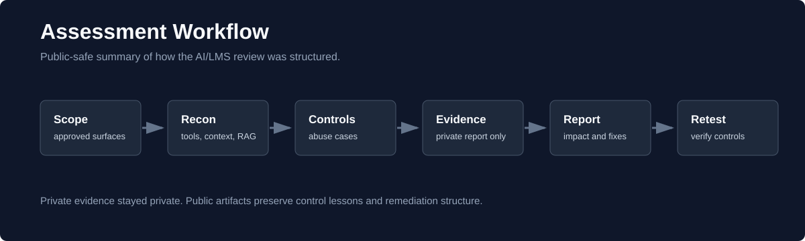

# Assessment Workflow

This workflow describes how the assessment was structured without revealing the
private target, exploit strings, or evidence.

## 1. Scope Confirmation

The first step was to define what was and was not in scope.

In scope:

- AI assistant behavior from an authenticated standard-user session
- Assistant tools exposed to that session
- User-editable assistant configuration
- LMS-provided user context
- Retrieval behavior for uploaded or indexed content
- Evidence collection sufficient for private reporting

Out of scope:

- Attacks against unrelated LMS features
- Attempts to access other user accounts
- Network or infrastructure testing
- Persistence outside the approved application workflow
- Publication of private evidence

## 2. Reconnaissance

The assessment began by mapping what the AI assistant appeared able to access:

- visible assistant modes and configuration panels
- tools available to the assistant
- user context injected into the session
- document retrieval surfaces
- memory or cross-session behavior
- platform integrations visible from the user interface

The goal was not to assume compromise. The goal was to understand the assistant's
effective authority from a regular user session.

## 3. Control Testing

Each test asked a control question:

| Control Area | Test Question |
|---|---|
| Tool access | Can the assistant send or retrieve data outside the platform? |
| Prompt hierarchy | Can user-authored instructions override higher-priority controls? |
| Safety configuration | Can a regular user weaken or bypass protective context? |
| User context | What user data is automatically placed into the AI session? |
| Retrieval | Can one user retrieve content that should belong to another context? |
| Memory | Does information persist across sessions or assistant modes? |
| Messaging | Can the assistant send trusted communications on behalf of a user? |

## 4. Evidence Handling

Evidence was collected for the private report only. Public artifacts are limited
to sanitized patterns, remediation guidance, and non-identifying diagrams.

Private evidence categories included:

- UI observations
- tool execution details
- request/response behavior
- assistant responses
- configuration screenshots
- impact notes

Public evidence categories are limited to:

- generic risk categories
- control questions
- sanitized remediation guidance
- lessons learned

## 5. Reporting

The private report used finding-level detail: severity, description, evidence,
impact, reproduction context, and remediation.

The public case study removes operational details and keeps only the transferable
security lessons.

## 6. Remediation Framing

Each recommendation was written to reduce a class of risk rather than patch a
single prompt. For AI/LMS systems, the highest-value controls are usually:

- least-privilege tool scopes
- request allowlists
- user-visible approval for external actions
- separation between system instructions and user-authored instructions
- document ownership checks for retrieval
- logs that show what the assistant did and why
- regression tests for known failure modes
